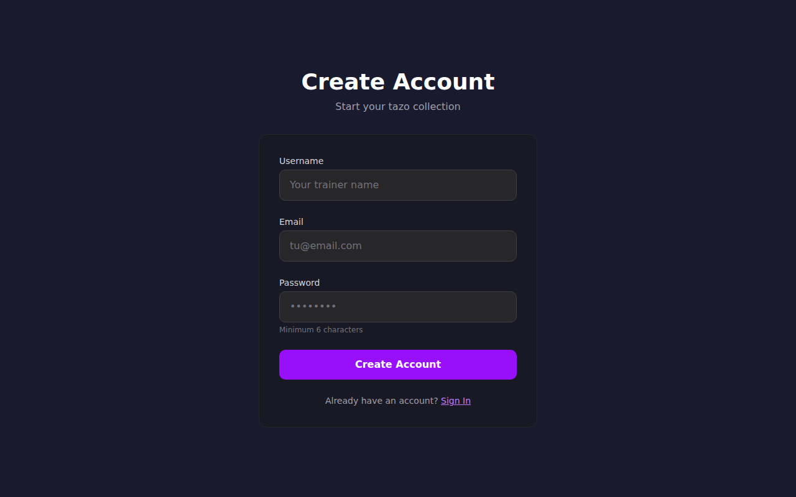

# 🎴 Trading Tazos Game

<div align="center">


**Aim. Throw. Flip. Capture. Win.**

[](https://nextjs.org)
[](https://www.typescriptlang.org)
[](https://www.prisma.io)
[](https://tailwindcss.com)
[](https://bun.sh)
[](./LICENSE)
[](https://medaclawarena.com)
[](https://medaclawarena.com/manifest.json)
[](./src/lib/i18n/locales/)
[](https://github.com/smouj/Trading-Tazos-Game/releases)

<br/>

**A skill-based physical tazo (pog) battle game with real-time physics, aim mechanics, 9 combat stats, and 319 verified tazos from Pokemon, Dragon Ball Z, and Digimon. Play in your browser, install as PWA, or download for desktop.**

🌐 **[medaclawarena.com](https://medaclawarena.com)** &nbsp;|&nbsp; 📧 **support@medaclawarena.com**

</div>

---

## 📸 Screenshots

<div align="center">

| Album & Collection | Battle Arena | Login & Auth |
|:---:|:---:|:---:|
|  |  |  |

| Landing Page | Registration | Collection |
|:---:|:---:|:---:|
|  |  |  |

</div>

---

## 🎮 What Makes It Different

> Trading Tazos Game is **not** a card game with stats. It's **not** auto-battle.  
> It's a game of **physical tazo throwing** — aim, power, physics, rebounds, risk, and field control.

### 🔄 Core Game Loop

1. **Select** a tazo from your hand
2. **Aim** horizontally and vertically with timing-based precision
3. **Charge** power — more impact, less accuracy
4. **Throw** into the arena
5. **Impact** enemy tazos — flip to capture, push them, or chain rebounds
6. **Risk it**: miss and your tazo stays vulnerable. Throw too hard and it flies out — the rival places it.

---

## ✨ Features

### ⚔️ Battle Arena
- 🎯 3-phase aim minigame: horizontal → vertical → power charge
- 🎱 Canvas 2D physics simulation with collision detection
- 💥 Multiple tazo hits per throw (chain rebounds)
- 🎲 Deterministic physics via **SeededRNG** (reproducible replays)
- 🤖 AI opponent with auto-resolve turns
- 🏆 2 game modes: **Classic** (capture all) + **Rounds** (points scoring)
- 📝 Turn-by-turn event log with Spanish battle descriptions

### 📚 Digital Album
- 🗂️ **319 real tazos** from verified Spanish collections
- 🔍 Filter by franchise, collection, category, variant, rarity
- 📋 Tazo detail with stats, evolutions, battle record
- 📊 Collection completion tracker with franchise breakdown

### 👤 User System
- 🔐 JWT-based authentication (register / login)
- 📦 **Personal collection** — add/remove tazos to your catalog
- 🃏 **Deck builder** — create battle decks from your collection
- 🎁 **Welcome pack** — 10 starter tazos + pre-built deck on registration
- 🌐 **10 languages** — auto-detected + persistent (EN, ES, PT, DE, FR, IT, JA, KO, ZH, RU)

### 🗃️ Real Collections

| Franchise | Collection | Year | Tazos | Status |
|-----------|-----------|------|-------|--------|
| ⚡ Pokémon | Pokémon Tazos 1 (Matutano) | 2000 | 51 | ✅ Verified |
| 🔥 Dragon Ball Z | DBZ Matutano | 1995 | 118 | ✅ 7 categories |
| 🦖 Digimon | Magic Box 2000 | 2000 | 150 | ✅ Verified names |
| | **TOTAL** | | **319** | |

---

## 🎯 Battle Mechanics

### Tazo Stats

| Stat | Icon | Role |
|------|:----:|------|
| **ATK** | ⚔️ | Impact power — how hard it hits |
| **DEF** | 🛡️ | Flipping resistance — stay upright |
| **SPIN** | 🌀 | Rebound & multi-hit potential |
| **WEIGHT** | ⚖️ | Push force & stability |
| **AURA** | ✨ | Special ability modifier |
| **CONTROL** | 🎯 | Accuracy & precision |

### Throw Risk/Reward

| Power | Circle Size | Impact | Accuracy |
|:-----:|:-----------:|:------:|:--------:|
| Low | Large | Weak | High |
| Medium | Medium | Balanced | Normal |
| High | Small | Strong | Low |
| Max | Tiny | Devastating | Risky — may fly out |

### Field Rules
- **Stay in**: Missed tazo stays on field where it landed
- **Out of bounds**: Rival places it anywhere in the arena
- **Capture 1+**: Thrower returns to hand
- **Self-flip**: Too much power + bad accuracy → you flip yourself

---

## 🛠️ Tech Stack

<div align="center">

| Layer | Technology | Version |
|-------|-----------|:-------:|
| Framework | [Next.js](https://nextjs.org) | 16.1 |
| Language | [TypeScript](https://typescriptlang.org) | 5.x |
| Styling | [Tailwind CSS](https://tailwindcss.com) | 4.x |
| UI Kit | [shadcn/ui](https://ui.shadcn.com) + [Lucide](https://lucide.dev) | Latest |
| ORM | [Prisma](https://prisma.io) | 6.x |
| Database | SQLite | 3.x |
| Runtime | [Bun](https://bun.sh) | 1.3 |
| Auth | bcryptjs + jsonwebtoken | — |
| Rendering | HTML5 Canvas 2D | — |
| Deploy | PM2 + Caddy | — |

</div>

---

## 📁 Project Structure

```
Trading-Tazos-Game/
├── prisma/
│   ├── schema.prisma              # 8 models: User, Franchise, Collection, Tazo,
│   │                              #   UserTazo, Deck, DeckTazo, BattleRecord
│   └── seed.ts                    # 319 real verified tazos from Spanish collections
├── src/
│   ├── app/
│   │   ├── api/
│   │   │   ├── auth/              # register, login, me
│   │   │   ├── collection/        # CRUD user tazos
│   │   │   ├── decks/             # CRUD battle decks
│   │   │   ├── tazos/             # Public tazo catalog
│   │   │   ├── battle/            # Battle simulation
│   │   │   ├── franchises/        # Franchise metadata
│   │   │   └── stats/             # Dashboard stats
│   │   ├── login/                 # Auth pages
│   │   ├── register/
│   │   ├── collection/            # User collection
│   │   ├── decks/                 # Deck builder
│   │   └── page.tsx               # Main SPA (album, battle, scanner, stats)
│   ├── components/
│   │   └── game/
│   │       ├── battle/            # Arena canvas, launch control, event log, result
│   │       ├── album-view.tsx      # Filterable tazo grid
│   │       ├── battle-view.tsx     # Full battle experience
│   │       └── scanner-view.tsx    # Photo upload + detection
│   └── lib/
│       ├── battle/                # Determistic physics engine (14-phase state machine)
│       ├── i18n/                  # 10-language system with auto-detection
│       ├── auth.ts                # JWT + bcrypt helpers
│       ├── auth-context.tsx        # AuthProvider + useAuth hook
│       └── db.ts                  # Prisma client singleton
├── public/tazos/
│   ├── pokemon/ (51)              # Pokémon Tazos 1 (Matutano 2000)
│   ├── dbz/ (118)                 # DBZ Matutano 1995 (7 categories)
│   └── digimon/ (150)             # Digimon Magic Box 2000
├── docs/screenshots/              # README screenshots
├── deploy.sh                      # Build → rsync → PM2 restart → verify
├── ecosystem.config.cjs           # PM2 process config
└── .env                           # Environment variables
```

---

## 🚀 Getting Started

### Prerequisites
- [Bun](https://bun.sh) ≥ 1.0
- Node.js ≥ 22

### Local Development

```bash
git clone https://github.com/smouj/Trading-Tazos-Game.git
cd Trading-Tazos-Game

bun install                              # Install dependencies
cp .env.example .env                     # Configure environment
bunx prisma db push                      # Create database tables
bun run seed                             # Seed 319 real tazos
bun run .zscripts/generate-tazos-svg.ts  # Generate tazo images

bun run dev                              # Start at http://localhost:3000
```

### Environment Variables

```bash
DATABASE_URL="file:./prisma/dev.db"
JWT_SECRET="your-secret-key-change-me"
NEXT_PUBLIC_DOMAIN=localhost:3000
NEXT_PUBLIC_SITE_NAME="Trading Tazos Game"
NEXT_PUBLIC_CONTACT_EMAIL=support@medaclawarena.com
NEXT_PUBLIC_BASE_URL=http://localhost:3000
PORT=3000
```

---

## 🚢 Deployment

### Production (medaclawarena.com)

```bash
# Deploy from local to VPS
./deploy.sh
```

The script handles: build → rsync standalone output → static files fix → PM2 restart → verification

### VPS Architecture

```
medaclawarena.com
  └── Caddy (reverse proxy, HTTPS, gzip, CSP, HSTS)
      └── PM2 `ttg` (fork, port 3000, Node.js 22)
          └── Next.js standalone server
              ├── Prisma ORM → SQLite
              └── HTML5 Canvas 2D Battle Engine
```

### PM2 Commands

```bash
ssh rpgvps "pm2 status"                           # Check process
ssh rpgvps "pm2 logs ttg --lines 50 --nostream"   # Recent logs
ssh rpgvps "pm2 restart ttg"                      # Restart
```

---

## 🌍 i18n — 10 Languages

Trading Tazos Game auto-detects language from `navigator.languages` and persists selection in `localStorage`.

| Code | Language | Code | Language |
|:----:|----------|:----:|----------|
| 🇬🇧 EN | English | 🇯🇵 JA | 日本語 |
| 🇪🇸 ES | Español | 🇰🇷 KO | 한국어 |
| 🇵🇹 PT | Português | 🇨🇳 ZH | 中文 |
| 🇩🇪 DE | Deutsch | 🇷🇺 RU | Русский |
| 🇫🇷 FR | Français | 🇮🇹 IT | Italiano |

---

## ⚠️ Disclaimer

This is a fan-made tribute project. Pokémon, Digimon, and Dragon Ball Z are trademarks of their respective owners. No copyrighted assets are included — all tazo images are original generated SVGs based on verified Spanish collections.

---

## 📝 Changelog

### v0.3.0 — 3D Shop + PWA + Credits + SEO (Jun 2026)
- 🎮 Play in browser, PWA, or desktop app
- 🥔 3D chip bag shop — buy bags, open them in 3D, reveal tazos
- 💰 Credit economy — earn 30cr per battle win, daily bonus
- 🛒 Navbar shop link + user dropdown integration
- 🔍 SEO overhaul — JSON-LD VideoGame schema, sitemap, robots.txt
- 📱 PWA — manifest.json, installable, offline-ready
- 🖼️ Custom favicon (3 sizes: 32/180/192)
- ⚖️ LICENSE — Source Available License v1.0
- 🧹 GitHub cleanup — removed .env, skills/ (300+ files)
- 🏷️ Battle credits API — +30 credits on win (JWT authenticated)

### v0.2.3 — Auth & Deck System
- ✅ JWT auth with bcrypt password hashing
- ✅ Personal tazo collection per user
- ✅ Deck builder with activate/delete
- ✅ Battle loads user's active deck
- ✅ Welcome pack (10 tazos + starter deck)
- ✅ Capture saving after battle

### v0.2.0 — Battle Engine v2
- ✅ Self-flip mechanic (high power + bad aim)
- ✅ Combo bonus (2+ captures per throw)
- ✅ Spanish battle descriptions
- ✅ Rounds mode with points scoring
- ✅ Canonical names for all 319 tazos

### v0.1.0 — Initial Launch
- ✅ 319 real verified Spanish tazos across 3 franchises
- ✅ Canvas 2D battle arena with physics
- ✅ 14-phase deterministic battle engine
- ✅ 10-language i18n system
- ✅ Magazine-inspired UI design

---

<div align="center">

**Made with 🎴 by [@smouj](https://github.com/smouj)**

*Physical tazos. Real physics. Pure nostalgia.*

</div>
