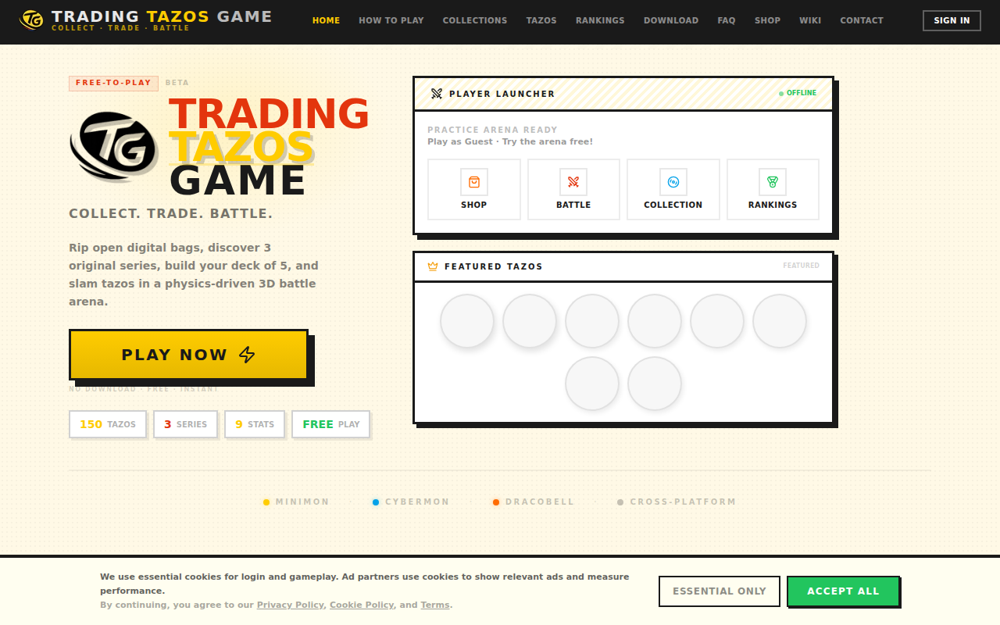
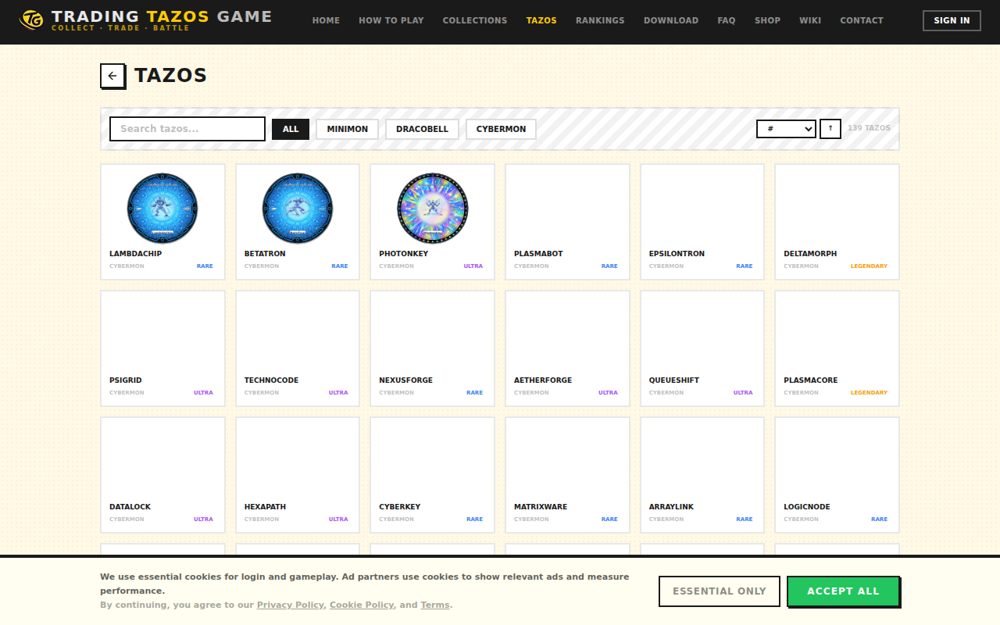
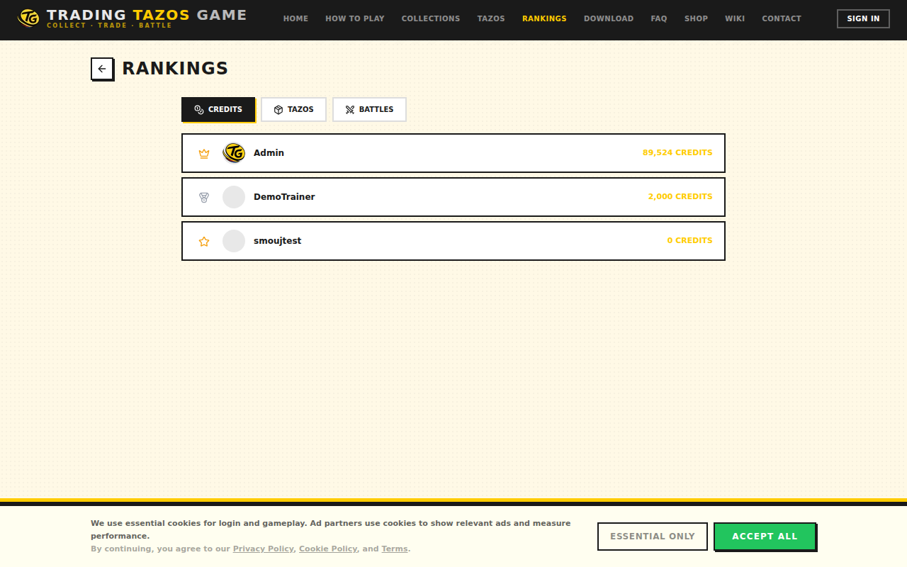
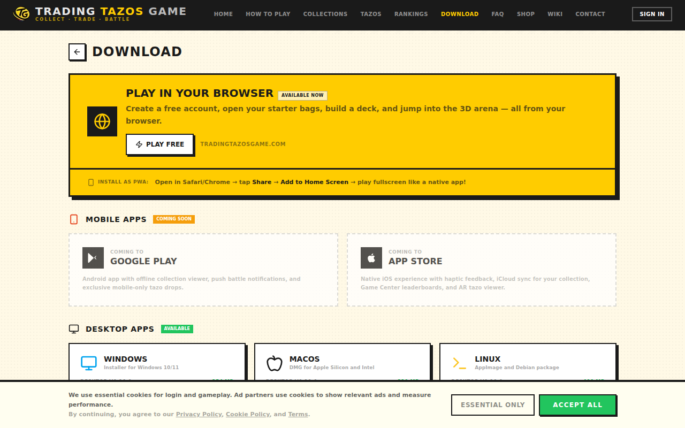
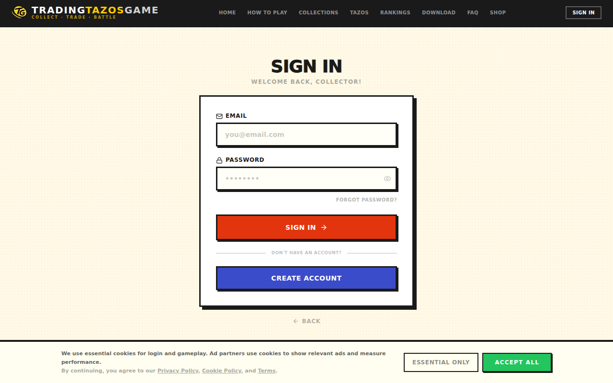
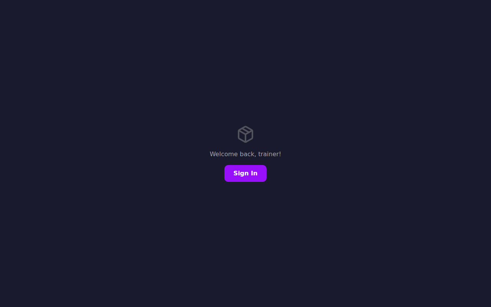
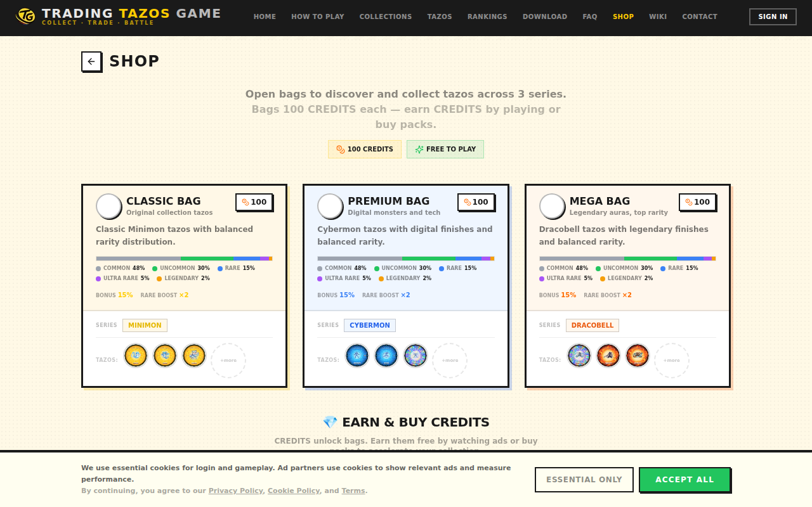

# 🎴 Trading Tazos Game

<div align="center">


### A Skill-Based Digital Tazo Battle Game

[](https://nextjs.org)
[](https://www.typescriptlang.org)
[](https://www.prisma.io)
[](https://tailwindcss.com)
[](https://bun.sh)
[](./LICENSE)
[](https://medaclawarena.com)
[](https://medaclawarena.com/manifest.json)
[](./src/lib/i18n/locales/)
[](#changelog)
[]()

<br/>

**Aim. Throw. Flip. Capture. Collect.**

Trading Tazos Game is a browser-based digital tazo (pog) battle game designed entirely with a 90s gaming magazine aesthetic — cream paper backgrounds, yellow mastheads, halftone dot patterns, bold comic typography, and 3px black border cards with drop shadows. You don't just compare stats — you aim, charge power, and throw tazos into a 3D physics-simulated arena. Features 319 tazos across 3 collections (Minimon, Dracobell, Cybermon), 9 combat stats, a unified 3D physics battle engine with AI opponents, real potato chip bag opening with 3D textures, and a full progression system with quests and achievements.

🌐 **[medaclawarena.com](https://medaclawarena.com)** &nbsp;|&nbsp; 📧 **support@medaclawarena.com**

</div>

---

## Screenshots

<div align="center">

| Landing Page | Tazo Catalog | Practice Battle |
|:---:|:---:|:---:|
|  |  |  |

| Leaderboard | Download | Sign In |
|:---:|:---:|:---:|
|  |  |  |

| App Tabs — Collection | App Tabs — Battle | App Tabs — Shop |
|:---:|:---:|:---:|
|  |  |  |

| Collection (Auth) | Decks (Auth) | Stats (App Tab) |
|:---:|:---:|:---:|
|  |  |  |

</div>

---

## What Makes It Different

Trading Tazos Game is **not** an auto-battle card game.
It's a game of **physical tazo throwing** — aim, power, physics, chain rebounds, risk, and field control.

### Core Game Loop

1. **Select** a tazo from your active deck
2. **Aim** horizontally and vertically with timing-based precision
3. **Charge** power — more impact, less accuracy
4. **Throw** into the 3D physics arena
5. **Impact** enemy tazos — flip to capture, push them out, or chain rebounds
6. **Risk it**: miss and your tazo stays vulnerable. Throw too hard and it flies out — the rival places it anywhere.

---

## Features

### Battle System
| Feature | Detail |
|---------|--------|
| Battle Engine | Deterministic physics with Three.js 3D rendering |
| Combat Stats | Attack, Defense, Resistance, Weight, Stability, Spin, Control, Bounce, Precision |
| Tazo Roles | Attacker, Tank, Technical, Bouncer, Heavy, Light, Balanced, Special (8 roles) |
| Aim Mechanics | 3-phase minigame: horizontal swing → vertical drop → power charge |
| Physics | 3D collision detection, momentum transfer, chain rebounds, self-flip mechanic |
| Game Modes | Classic (capture all) + Rounds (points scoring per round) |
| Risk System | Overpower = may fly out of bounds. Miss = vulnerable on field |
| Event Log | Turn-by-turn styled battle log with impact messages |

### Collection & Progression
| Feature | Detail |
|---------|--------|
| Tazo Database | 319 tazos: 51 Minimon, 118 Dracobell, 150 Cybermon |
| Personal Collection | Track owned tazos, mark favorites, view acquisition dates |
| Decks | Build, name, and activate battle decks (5 tazos each) |
| Welcome Pack | 10 starter tazos + pre-built deck on registration |
| Stats Panel | Collection completion %, franchise breakdown, rarity distribution |

### Economy & Shop
| Feature | Detail |
|---------|--------|
| 3D Bag Shop | Buy tazo bags with credits, tear them open with 3D animation, reveal what you got |
| Bag Types | Standard (50cr), Premium (150cr), Mega (400cr) with rare boost multipliers |
| Credit System | Earn via battles (+30), daily login (+25), quests (+50–200) |
| Rarity System | 5 tiers: Common, Uncommon, Rare, Ultra-Rare, Legendary |
| Weighted Drops | Rare boost multiplier per bag type (1× / 2× / 3×) |

### Quests & Achievements
| Feature | Detail |
|---------|--------|
| Quests | 17 quests: Beginner, Daily, Weekly, and Special categories |
| Achievements | 18 achievements: Bronze → Silver → Gold → Platinum |
| Leaderboards | Global rankings by credits, tazos collected, or battles played |
| Progress Tracking | Per-quest progress bars + per-achievement unlock tracking |

### Multiplayer
| Feature | Detail |
|---------|--------|
| PvP Battles | WebSocket matchmaking lobby with JWT auth; full turn sync is rolling out in stages |
| Room System | Private battle rooms between two players |
| Match Events | Matchmaking and room events are live; full turn sync is rolling out in stages |

### Platform
| Feature | Detail |
|---------|--------|
| Web | Full Next.js 16 app at [medaclawarena.com](https://medaclawarena.com) |
| PWA | Installable on mobile and desktop with manifest.json |
| Desktop | Electron app — [v0.3.1](https://github.com/smouj/Trading-Tazos-Game/releases/tag/v0.3.1) installers for Windows (.exe), macOS (.dmg), and Linux (.AppImage, .deb) |
| i18n | 10 languages: EN, ES, PT, DE, FR, IT, JA, KO, ZH, RU |
| SEO | JSON-LD VideoGame schema, sitemap.xml, robots.txt, hreflang alternates |
| Security | CSP + HSTS + X-Frame-Options + dual cookie auth |

### Auth & User System
| Feature | Detail |
|---------|--------|
| Authentication | JWT + bcryptjs (12 rounds) with httpOnly + companion cookies |
| Session Detection | `/api/auth/ping` cookie check + localStorage Bearer token sync |
| Route Protection | Proxy guards `/app/*` → redirects to `/login?redirect=...` |
| User Profile | `/app/settings` — profile card, collection stats, logout |
| Auth-Aware Headers | Landing shows "Play Now" when logged in, dashboard shows Logout |
| 2-Shell System | PublicPageShell (landing/SEO) + MagazinePageShell (dashboard) |

---

## Collections

| # | Collection | Origin | Tazos |
|:--:|-----------|--------|:-----:|
| 1 | **Minimon** — inspired by Pokémon Tazos 1 (Matutano, 2000) | Spain | 51 |
| 2 | **Dracobell** — inspired by Dragon Ball Z (Matutano, 1995) | Spain | 118 |
| 3 | **Cybermon** — inspired by Digimon Magic Box (2000) | Spain | 150 |
| | | **Total** | **319** |

All 319 tazos verified against original Spanish physical collections. Each tazo has 9 balanced combat stats, a tactical role, and evolutive relationships (pre-evolution, evolution, transformation stage). Names have been minimally tweaked to avoid IP conflicts while staying instantly recognizable.

---

## Combat Stats

| Stat | Icon | Description |
|------|:----:|-------------|
| Attack | ATK | Impact power — how hard it hits opponents |
| Defense | DEF | Flipping resistance — stay upright on impact |
| Resistance | RES | Difficulty to be flipped or pushed |
| Weight | WGT | Physical mass — affects damage, push force, and stability |
| Stability | STB | Prevents self-flips, knockbacks, and out-of-bounds |
| Spin | SPN | Maintains rotation and energy after landing |
| Control | CTR | Reduces throw deviation for better accuracy |
| Bounce | BNC | Improves rebounds and chained multi-hits |
| Precision | PRC | Improves aim and reduces horizontal/vertical error |

### Throw Risk / Reward

| Power Level | Circle Size | Impact | Accuracy | Risk |
|:-----------:|:-----------:|:------:|:--------:|------|
| Low | Large | Weak | High | Safe — stays in bounds |
| Medium | Medium | Balanced | Normal | Standard risk |
| High | Small | Strong | Low | May scatter unpredictably |
| Maximum | Tiny | Devastating | Very Low | High chance of self-flip or flying out |

---

## Tech Stack

| Layer | Technology |
|-------|-----------|
| Framework | Next.js 16.1 (App Router, Server Components, Turbopack) |
| Language | TypeScript 5.x (strict mode) |
| Styling | Tailwind CSS 4 + custom magazine theme system ([THEME.md](./THEME.md)) |
| UI Components | shadcn/ui (Radix primitives) + Lucide React icons |
| 3D Rendering | Three.js + @react-three/fiber + @react-three/drei (battle-only) |
| Battle Graphics | Three.js 3D physics arena (2D for collection, stats, shop) |
| ORM | Prisma 6.x (12 models, automated migrations) |
| Database | SQLite (zero-config, portable, 360 KB with 319 tazos) |
| Auth | JWT (jsonwebtoken) + bcryptjs (12 rounds) + httpOnly cookies |
| Multiplayer | WebSocket (ws) with JWT auth and room system |
| Desktop | Electron with animated splash, system tray, single-instance lock |
| Runtime | Bun (build) + Node.js 22 (production) |
| Monitoring | Plausible Analytics (self-hosted) |

---

## Project Structure

```
Trading-Tazos-Game/
├── prisma/
│   ├── schema.prisma        # 12 models + automated migrations
│   ├── seed.ts              # 319 tazos (seed data)
│   └── seed-quests.ts       # 17 quests + 18 achievements
├── src/
│   ├── proxy.ts              # Auth route protection + legacy redirects
│   ├── app/
│   │   ├── page.tsx          # Landing page (hero, collections, CTAs)
│   │   ├── layout.tsx        # Root layout (SEO, PWA, JSON-LD, i18n)
│   │   ├── app/              # 🎮 Dashboard (auth-protected, MagazinePageShell, 7 tabs)
│   │   │   ├── collection/   # Personal tazo collection & manager
│   │   │   ├── battle/       # Battle lobby → fullscreen 3D arena routes
│   │   │   ├── stats/        # Collection stats & analytics
│   │   │   ├── shop/         # 3D bag shop (buy → open → reveal)
│   │   │   ├── quests/       # Quest system (daily, weekly, special)
│   │   │   ├── collection/   # Personal tazo collection
│   │   │   ├── decks/        # Deck builder + active deck switcher
│   │   │   └── settings/     # User profile & settings
│   │   ├── how-to-play/      # Public SEO page — game guide
│   │   ├── battle-system/    # Public SEO page — combat mechanics
│   │   ├── collections/      # Public SEO pages — franchise showcases
│   │   ├── tazos/            # Public catalog + rarity tiers
│   │   ├── faq/              # Public FAQ page
│   │   ├── leaderboard/      # Global rankings (public)
│   │   ├── download/         # Desktop app downloads (public)
│   │   ├── terms/            # Legal pages
│   │   ├── privacy/          #
│   │   ├── cookies/          #
│   │   ├── disclaimer/       #
│   │   ├── login/            # Auth pages
│   │   ├── register/         #
│   │   └── api/              # 17 REST API route groups
│   ├── components/game/
│   │   ├── battle/           # Launch controls, event log, results
│   │   ├── 3d/               # Battle-only 3D arena and tazo discs
│   │   ├── album-view.tsx    # Tazo grid with flip/view modes (legacy, merged into collection)
│   │   ├── tazo-card.tsx     # Individual tazo display
│   │   ├── tazo-detail-modal.tsx  # 9-stat detail + evolutive info
│   │   ├── stats-panel.tsx   # Collection analytics
│   │   └── scanner-view.tsx  # Upload → crop → detect physical tazo
│   └── lib/
│       ├── battle/           # 14-phase deterministic engine
│       ├── i18n/             # 10-language system with auto-detection
│       ├── auth.ts           # JWT + bcrypt helpers
│       ├── auth-context.tsx  # AuthProvider + useAuth hook
│       ├── multiplayer.ts    # WebSocket client (auto-reconnect)
│       └── db.ts             # Prisma client singleton
├── electron/
│   └── main.js               # Electron main process
├── src/server/
│   └── ws-server.js          # Standalone WebSocket server
├── public/
│   ├── logo/                 # 6 logo variants + social banners
│   ├── manifest.json         # PWA manifest
│   ├── robots.txt            # SEO + AI crawler rules
│   └── sitemap.xml           # 18 public URLs
├── THEME.md                  # Design system spec (colors, typography, components)
├── electron-builder.yml      # Desktop app build config
├── build-electron.sh         # Electron build script
└── package.json
```

> **Note:** Device-specific config files (`deploy.sh`, `ecosystem.config.cjs`, `Caddyfile`, `.zscripts/`) are excluded from the public repo. Template versions are available for self-hosting: [`deploy.example.sh`](./deploy.example.sh), [`Caddyfile.example`](./Caddyfile.example), [`ecosystem.config.ci.example.cjs`](./ecosystem.config.ci.example.cjs).

---

## Getting Started

### Prerequisites
- [Bun](https://bun.sh) 1.x (or Node.js 22+)
- SQLite (bundled — no external DB needed)

### Install & Run

```bash
git clone https://github.com/smouj/Trading-Tazos-Game.git
cd Trading-Tazos-Game

bun install                              # Dependencies
cp .env.example .env                     # Set your JWT_SECRET
bunx prisma db push                      # Create database
bun run seed                             # 319 tazos + 17 quests + 18 achievements

bun run dev                              # http://localhost:3000
```

### Environment Variables

```bash
DATABASE_URL="file:./prisma/dev.db"
JWT_SECRET="generate-a-random-secret-here"
NEXT_PUBLIC_SITE_NAME="Trading Tazos Game"
NEXT_PUBLIC_BASE_URL=http://localhost:3000
```

---

## Deployment

The live app runs at **[medaclawarena.com](https://medaclawarena.com)** using PM2 + Caddy on a VPS. See [`deploy.example.sh`](./deploy.example.sh) for the annotated deploy pipeline and [`Caddyfile.example`](./Caddyfile.example) for the reverse-proxy configuration.

### Production Architecture

```
medaclawarena.com
  └── Caddy (TLS 1.3, gzip, CSP, HSTS, WebSocket upgrade)
      ├── PM2 `ttg`     (fork, :3000) — Next.js standalone server
      └── PM2 `ttg-ws`  (fork, :3001) — WebSocket battle server
```

---

## i18n — 10 Languages

Detects language from `navigator.languages` / `Accept-Language` header, persists in `localStorage`.

| Code | Language    | Coverage |
|:----:|-------------|:--------:|
|  EN  | English     | 100%     |
|  ES  | Spanish     | 100%     |
|  PT  | Portuguese  | 100%     |
|  DE  | German      | 100%     |
|  FR  | French      | 100%     |
|  IT  | Italian     | 100%     |
|  JA  | Japanese    | 100%     |
|  KO  | Korean      | 100%     |
|  ZH  | Chinese     | 100%     |
|  RU  | Russian     | 100%     |

---

## Design System

The game uses a **90s Nintendo Power / Pokémon Magazine** aesthetic specified in [`THEME.md`](./THEME.md). Every visual element follows a documented design system:

- 12-token color palette (`#FFCC00` yellow, `#E3350D` red, `#3B4CCA` blue, ...)
- 7-level typography hierarchy (all `font-black` + `uppercase`)
- 4-level border + shadow system on `#1a1a1a`
- 30+ documented CSS utility classes (`mag-card`, `mag-btn`, `mag-stroke`, `mag-bg`, ...)
- Component anatomy diagrams for cards, buttons, page shells
- 15 anti-pattern rules (no emojis, no grays, no `rounded-xl`, no default Tailwind shadows)

---

## Desktop App

Desktop installers for all platforms are available on the [Releases page](https://github.com/smouj/Trading-Tazos-Game/releases/latest).

| Platform | Format | Status |
|----------|--------|--------|
| Linux | AppImage, .deb | ✅ Available |
| Windows | .exe (NSIS) | ✅ Available |
| macOS | .dmg, .zip | ✅ Available |

---

## CLI (Planned)

A terminal interface for searching, inspecting, and simulating battles with tazos:

```bash
tazos search minimon     # Search the tazo database
tazos info 25            # Full stats breakdown
tazos stats              # Collection statistics
tazos top --stat attack  # Leaderboard by any stat
tazos battle --seed 42   # Simulate a physics battle
```

📦 CLI repo: [github.com/smouj/trading-tazos-game-cli](https://github.com/smouj/trading-tazos-game-cli) (development)

---

## Disclaimer

**This is an original game built on verified physical collection data.** Tazo names have been minimally tweaked to avoid intellectual property conflicts with the franchises that inspired the original physical tazos (Pokémon, Dragon Ball, Digimon). No copyrighted images, audio, or brand assets are included — all tazo visuals are original generated SVGs. The game's engine, design, styling, and codebase are original work.

---

## License

**Source Available License v1.0** — see [LICENSE](./LICENSE) for full terms.

- ✅ Personal use, modification, and self-hosting
- ✅ Contributions welcome (grant license back)
- ❌ Commercial redistribution without permission
- ❌ Selling the software or offering it as a service

---

## Changelog

### v0.3.0 — 3D Shop + Quests + Desktop App + Public SEO (Jun 2026)
- **Entry animations**: Staggered fade-up on landing hero, skeleton loaders, loading states
- **Magazine arena**: Cream/halftone background, yellow ring, white field — matches THEME.md
- **Dashboard**: 7 tabs under `/app/*` (collection, battle, shop, decks, stats, quests, settings)
- **Auth**: Dual cookie system (httpOnly + companion), `/api/auth/ping` endpoint, auto session detection
- **3-shell architecture**: PublicPageShell (landing/SEO, 16 pages) + MagazinePageShell (dashboard, 7 tabs) + GameShell (fullscreen battle) + LauncherView (autonomous home)
- **Auth-aware headers**: Landing shows "Play Now" when logged in, dashboard shows Logout + Back to Home
- **Settings page**: `/app/settings` with profile card, stats, and logout
- 13 public SEO pages: landing, how-to-play, battle-system, collections, tazos, FAQ
- 4 legal pages: terms, privacy, cookies, disclaimer
- 3D chip bag shop with tear animation and rarity-based drops
- Credit economy: battles +30cr, daily login +25cr, quests +50–200cr
- 17 quests across 4 categories with progress tracking
- 18 achievements with 4-tier progression (Bronze → Platinum)
- Global leaderboards: credits, tazos collected, battles played
- Auth proxy with httpOnly cookies, login redirect, 8 legacy URL redirects
- PWA manifest and installable web app metadata
- Electron desktop launcher: animated splash, system tray, single-instance
- Linux installers: .AppImage + .deb
- SEO: JSON-LD VideoGame schema, sitemap.xml, robots.txt, hreflang
- Design system spec ([THEME.md](./THEME.md)) with documented tokens
- WebSocket multiplayer: JWT auth, matchmaking queue, room system, staged turn relay
- Security: CSP, HSTS, X-Frame-Options, dual cookie auth
- Page-specific metadata with unique titles per route
- i18n: 10 languages with 250+ translated keys

### v0.2.3 — Auth & Deck System
- JWT authentication with bcrypt password hashing (12 rounds)
- Personal tazo collection per user with favorites
- Deck builder with active deck switching (5 tazos per deck)
- Welcome pack: 10 starter tazos + pre-built deck on registration
- WebSocket multiplayer server with native crypto JWT

### v0.2.0 — Battle Engine v2
- 9-stat combat system: Attack, Defense, Resistance, Weight, Stability, Spin, Control, Bounce, Precision
- 8 tazo roles with unique stat distributions
- Self-flip mechanic: overpower = you flip yourself
- Combo bonus: 2+ captures in one throw = extra points
- Rounds game mode with points scoring
- i18n: 10 languages with auto-detection
- Canonical franchise naming (Minimon, Dracobell, Cybermon)

### v0.1.0 — Initial Launch
- 319 verified Spanish tazos across 3 collections
- 3D battle arena with physics simulation (Three.js / R3F)
- Deterministic battle engine
- 90s Nintendo Power magazine aesthetic
- Personal collection with franchise, rarity, and stats filters
- 3D tazo disc rendering

---

<div align="center">

**Made by [@smouj](https://github.com/smouj)** &nbsp;|&nbsp; **[medaclawarena.com](https://medaclawarena.com)**

*Digital tazos. Real 3D physics. Pure nostalgia.*

</div>
