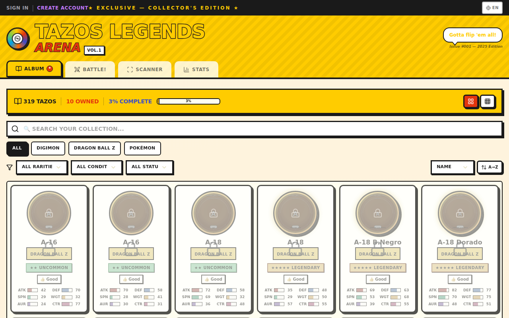

# 🎮 Tazos Legends Arena

> **Escanea tus tazos antiguos, crea tu álbum digital y hazlos combatir en una arena física.**

A nostalgic web game inspired by the golden age of collectible tazos (pogs) from the 90s-2000s. Designed with a vibrant **magazine aesthetic** — think Nintendo Power meets Pokémon Official Magazine.



---

## ✨ Features

### 📖 Digital Album
Browse your tazo collection in a vibrant magazine-style interface. Filter by franchise, rarity, condition, and ownership status. Each tazo is displayed as a circular disc with franchise-colored gradients and special effects.


### ⚔️ Battle Arena
Select your team of 3 tazos and fight against AI opponents in a physics-based arena. Watch spinning discs collide, trigger type advantages, evolve Digimon, and charge ki for DBZ transformations!


### 📷 Tazo Scanner
Import photos of your real tazos! The scanner detects circular shapes, crops individual tazos, and lets you add metadata to create playable pieces from your physical collection.


### 📊 Stats Dashboard
Track your collection progress with magazine-style infographics. See breakdowns by franchise, rarity, condition, and discover your top combatants.


---

## 🎨 Design Philosophy

The entire UI is inspired by **90s-2000s gaming magazines**:

| Element | Style | Inspiration |
|---------|-------|-------------|
| **Colors** | Vibrant yellow, red, blue primary colors | Pokémon Magazine |
| **Typography** | Bold, black-outlined stroke text | Nintendo Power |
| **Cards** | Thick black borders, offset shadows | Magazine clippings |
| **Navigation** | Magazine section tabs | Table of contents |
| **Effects** | Holographic shimmer, metallic shine, legendary glow | Real tazo finishes |

### Magazine Aesthetic Details
- **Stroke text**: Bold yellow/red text with black outlines (`-webkit-text-stroke`)
- **Thick borders**: 3px solid black on all cards and buttons
- **Offset shadows**: `4px 4px 0px black` — like printed stickers
- **Speech bubbles**: Comic-style callouts with character quotes
- **EXCLUSIVE badges**: Rotated red stickers on legendary tazos
- **Halftone dots**: Magazine print texture on backgrounds

---

## 🕹️ Game Mechanics

### Franchise-Specific Abilities

| Franchise | Mechanic | Effect |
|-----------|----------|--------|
| **Pokémon** | Type Advantages | Fire > Grass > Water > Fire, Electric > Water, etc. (1.5x damage) |
| **Digimon** | Digievolution | Link evolution chain tazos → +15 to all stats |
| **Dragon Ball Z** | Ki Charge & Transform | Charge ki each round, transform at round 3+ with 30+ ki |

### Victory Types
- **Knockout** — Tazo loses all HP
- **Ring-out** — Tazo flies out of the arena
- **Spin-out** — Tazo stops spinning before opponent
- **Combo** — Most HP remaining after 10 rounds

### Tazo Conditions
| Condition | Effect |
|-----------|--------|
| ✨ Mint | +20% collection value |
| 👍 Good | Normal stats |
| 🔄 Used | -10% control |
| ⚔️ Worn | -20% spin, +15% veteran bonus |
| 🌈 Holographic | +30% aura |
| 🛡️ Metallic | +25% weight |

### Stats
Each tazo has 6 stats: **ATK**, **DEF**, **SPIN**, **WGT**, **AURA**, **CTR**

---

## 🛠️ Tech Stack

- **Framework**: Next.js 16 with App Router
- **Language**: TypeScript 5
- **Styling**: Tailwind CSS 4 + Custom Magazine Theme
- **UI Components**: shadcn/ui (New York style)
- **Database**: Prisma ORM with SQLite
- **Image Processing**: Sharp
- **Battle Engine**: HTML5 Canvas + Custom Physics
- **Icons**: Lucide React

---

## 🚀 Getting Started

### Prerequisites
- Node.js 18+ or Bun
- npm/bun package manager

### Installation

```bash
# Clone the repository
git clone https://github.com/smouj/Trading-Tazos-Game.git
cd Trading-Tazos-Game

# Install dependencies
bun install

# Set up the database
bun run db:push

# Seed the database with sample tazos
bun run seed

# Start the development server
bun run dev
```

Open [http://localhost:3000](http://localhost:3000) in your browser.

---

## 📸 Screenshots

### Album - Collection Browser


### Tazo Detail Modal


### Battle - Team Selection


### Battle - Arena Combat


### Battle - Results


### Tazo Scanner


### Stats Dashboard


---

## 📁 Project Structure

```
Trading-Tazos-Game/
├── prisma/
│   ├── schema.prisma       # Database schema
│   └── seed.ts             # Seed data (62 tazos, 3 franchises)
├── src/
│   ├── app/
│   │   ├── api/            # REST API routes
│   │   │   ├── tazos/      # CRUD + toggle-owned
│   │   │   ├── battle/     # Battle simulation
│   │   │   ├── battles/    # Battle history
│   │   │   ├── franchises/ # Franchise data
│   │   │   ├── stats/      # Dashboard stats
│   │   │   └── scanner/    # Upload, detect, crop
│   │   ├── globals.css     # Magazine theme + animations
│   │   ├── layout.tsx
│   │   └── page.tsx        # Main SPA page
│   ├── components/
│   │   ├── game/           # Game-specific components
│   │   │   ├── album-view.tsx
│   │   │   ├── battle-view.tsx
│   │   │   ├── battle-canvas.tsx
│   │   │   ├── battle-select-card.tsx
│   │   │   ├── scanner-view.tsx
│   │   │   ├── stats-panel.tsx
│   │   │   ├── tazo-card.tsx
│   │   │   ├── tazo-detail-modal.tsx
│   │   │   ├── tazo-editor.tsx
│   │   │   └── add-tazo-dialog.tsx
│   │   └── ui/             # shadcn/ui components
│   ├── lib/
│   │   ├── game/types.ts   # Game type definitions
│   │   ├── db.ts           # Prisma client
│   │   └── utils.ts        # Utility functions
│   └── hooks/              # Custom React hooks
└── docs/
    └── screenshots/        # Real app screenshots
```

---

## ⚠️ Disclaimer

This is a **private, non-commercial fan project**. It does not include any official images, logos, or copyrighted assets.

- Pokémon is a trademark of Nintendo/Game Freak
- Digimon is a trademark of Bandai
- Dragon Ball Z is a trademark of Toei Animation

The game uses **placeholders** — real tazo images should be imported locally from `/private-assets/` (excluded from the repository via `.gitignore`).

---

## 📜 License

Private repository. All rights reserved. This project is for personal, non-commercial use only.

---

<p align="center">
  <strong>★ EXCLUSIVE — COLLECTOR'S EDITION ★</strong><br/>
  <em>Tazos Legends Arena — Vol.1, Issue #001</em>
</p>
